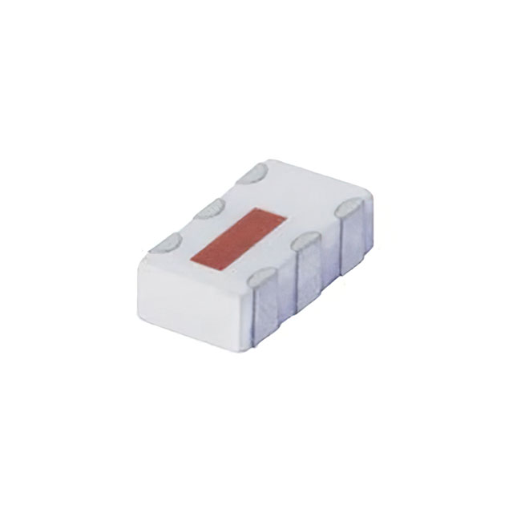
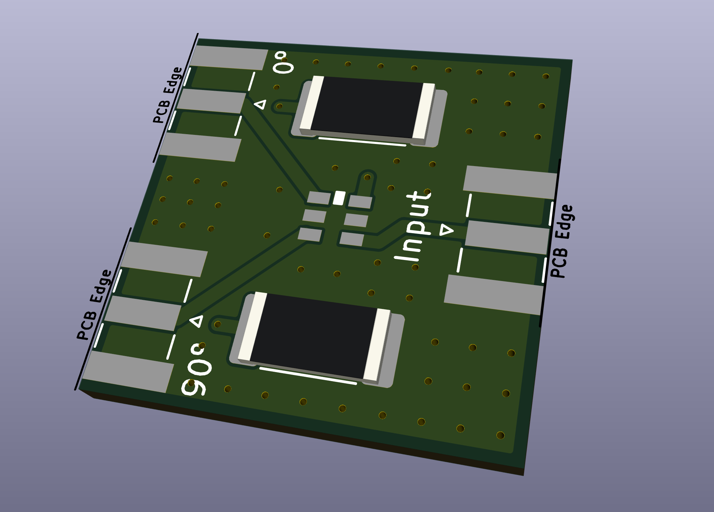
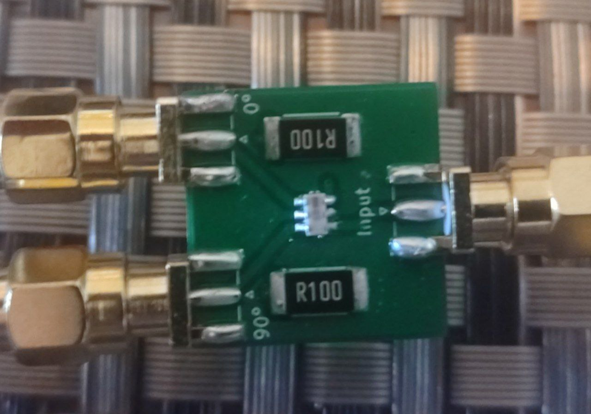
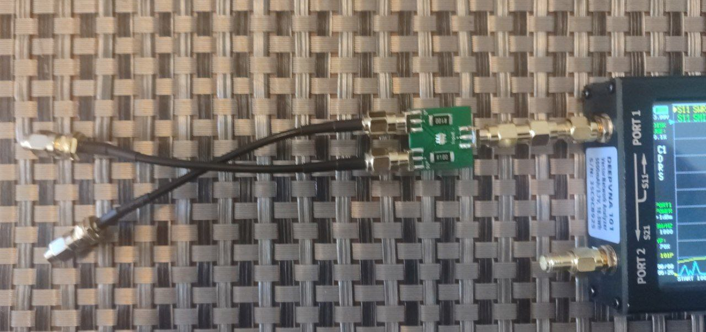
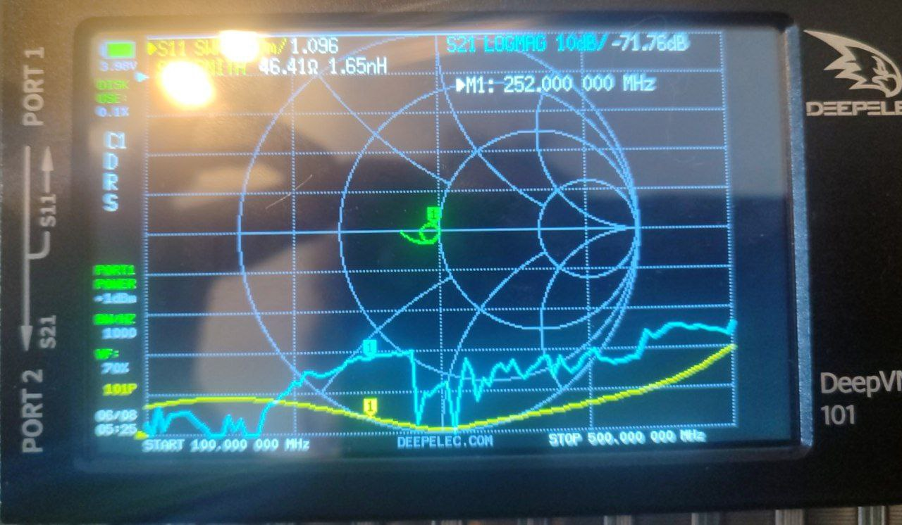
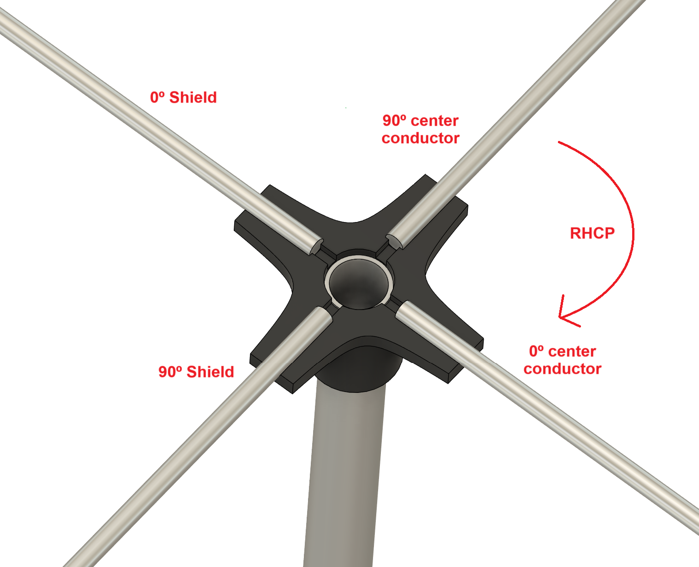
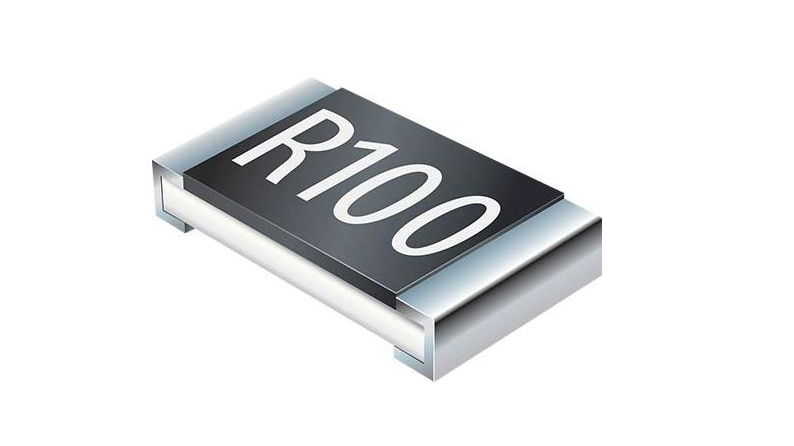
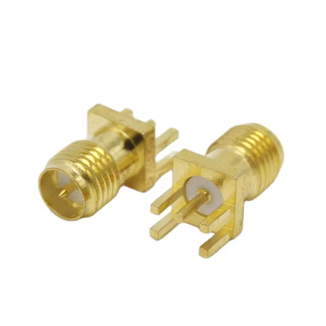

# QCN3-Board

PCB board for the hybrid coupler QCN3

## Warning, maximum transmission power (datasheet) is 15W. But it's better to not go over 5-10W

	
	

It allows to do the right hand circular polarization without having to deal with coax cables.  

------

Nano VNA results (with 2 50 ohms loads at the outputs)

	
	

------

Connect the 90º pin to the right of the 0º pin to allow **right hand circular polarization**.  
Make sure that the 2 output wires have the same length!

------

You can order it at jlcpcb or other companies using the gerber zip file in this repository.  
Make sure to order it with 1.6 board width  

------

BOM:

- 1x QCN-3
- 2x SMD resistor 2512 100Ω 2W
- 3x SMA connectors for PCB with 1.6mm spacing

	
	
	

